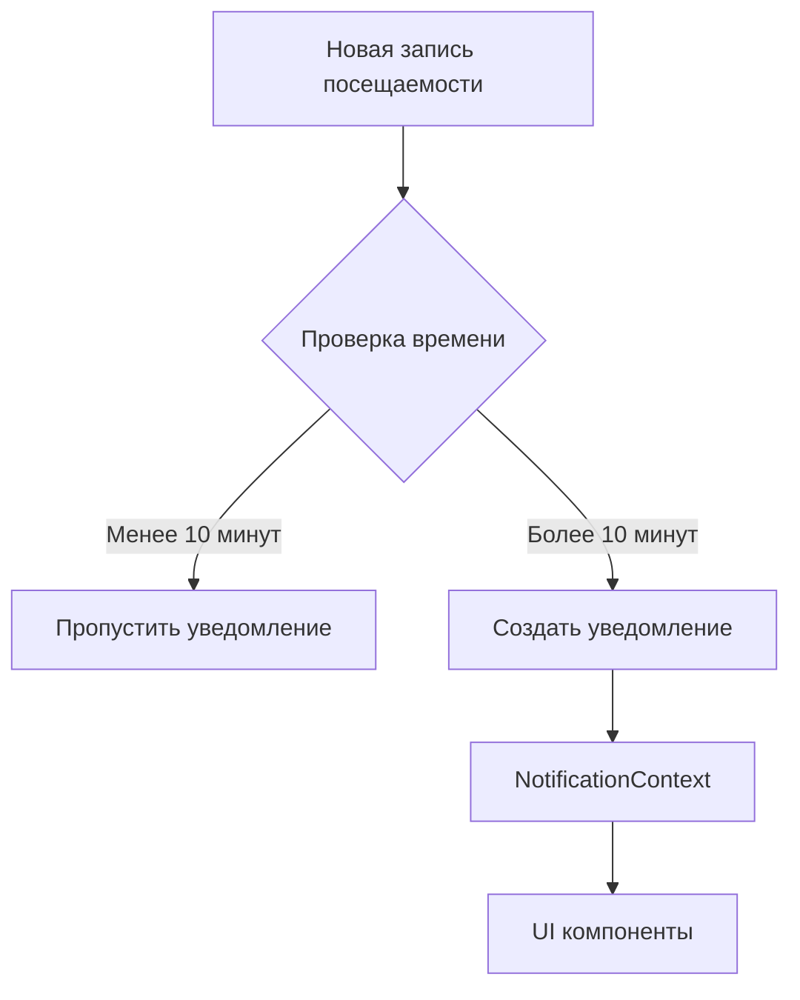

# Система уведомлений для тренеров

## Обзор

Система уведомлений для тренеров предоставляет возможность получать уведомления о новых записях посещаемости от учеников. Это позволяет тренерам быть в курсе активности своих учеников и оперативно реагировать на изменения.

## Архитектура

### Компоненты системы

1. **CoachNotificationService** - сервис для управления записями посещаемости и уведомлениями
2. **useCoachNotifications** - хук для интеграции уведомлений в React-компоненты
3. **NotificationContext** - контекст для управления глобальным состоянием уведомлений

### Поток данных

## Реализация

### CoachNotificationService

Сервис предоставляет следующие функции:

- `saveAttendanceRecord` - сохранение новой записи посещаемости
- `getAttendanceRecords` - получение всех записей посещаемости
- `checkForNewAttendanceRecords` - проверка наличия новых записей и создание уведомлений
- `getLastNotificationTime` - получение времени последнего уведомления
- `cleanupOldRecords` - очистка старых записей (старше 30 дней)

### useCoachNotifications

Хук интегрирует систему уведомлений в приложение:

- Автоматически проверяет наличие новых записей каждые 5 минут
- Создает уведомления через NotificationContext
- Работает только для пользователей с ролью "coach"

### Интеграция

Хук интегрирован в компонент навигации `AppNavigator.tsx` и активен для всех авторизованных тренеров.

## Особенности реализации

### Ограничение частоты уведомлений

Для предотвращения избыточных уведомлений реализован механизм ограничения частоты:

- Уведомления отправляются не чаще одного раза в 10 минут
- Время последнего уведомления сохраняется в AsyncStorage

### Очистка данных

Для предотвращения накопления большого объема данных:

- Автоматическая очистка записей старше 30 дней
- Очистка происходит при каждой проверке новых записей

## Планируемые улучшения

### Реализация реальных уведомлений

В текущей реализации используется имитация новых записей. В будущем планируется:

- Интеграция с реальной системой посещаемости
- Отслеживание реальных изменений в данных посещаемости
- Персонализация уведомлений для каждого тренера

### Расширение функциональности

Планируется расширить систему уведомлений:

- Уведомления о новых результатах тренировок
- Уведомления о достижениях учеников
- Уведомления о предстоящих тренировках
- Настройка предпочтений уведомлений

## Тестирование

Система протестирована на следующих сценариях:

- Проверка корректности создания уведомлений
- Проверка ограничения частоты уведомлений
- Проверка работы только для тренеров
- Проверка очистки старых данных

## Безопасность

- Все данные хранятся локально в AsyncStorage
- Нет передачи персональных данных на внешние серверы
- Реализована валидация данных перед сохранением
